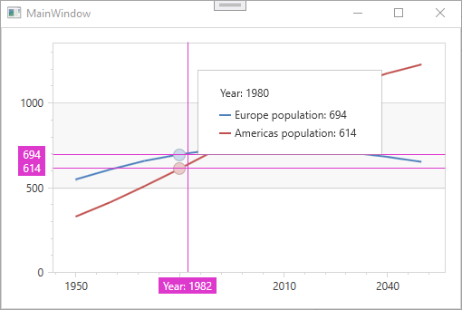

<!-- default badges list -->

<!-- default badges end -->

# Chart for WPF -  How to Format Values in a Crosshair Cursor with Label Patterns

This example demonstrates how to change text displayed in crosshair labels with crosshair patterns. 

Specify a displayed pattern within a crosshair label with the following properties:

* [CrosshairAxisLabelOptions.Pattern](https://docs.devexpress.com/WPF/DevExpress.Xpf.Charts.CrosshairAxisLabelOptions.Pattern)
* [XYSeries2D.CrosshairLabelPattern](https://docs.devexpress.com/WPF/DevExpress.Xpf.Charts.XYSeries2D.CrosshairLabelPattern)
* [CrosshairOptions.GroupHeaderPattern](https://docs.devexpress.com/WPF/DevExpress.Xpf.Charts.CrosshairOptions.GroupHeaderPattern)

You can use standard and custom format specifiers are used together with the placeholders to format numeric and date/time values (e.g., {A:F0}). 

## Files to Review

* [MainWindow.xaml](./CS/UsingCrosshairLabelPattern/MainWindow.xaml) (VB: [MainWindow.xaml](./VB/UsingCrosshairLabelPattern/MainWindow.xaml))

## Documentation

* [Format Specifiers](http://documentation.devexpress.com/#WindowsForms/CustomDocument2141)
* [Crosshair Cursor](http://documentation.devexpress.com/#WPF/CustomDocument11974)

<!-- feedback -->
## Does this example address your development requirements/objectives?

 

(you will be redirected to DevExpress.com to submit your response)
<!-- feedback end -->
